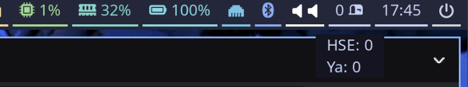

# wb-inbox-mail-count

<!-- TODO: актуализировать ссылки -->
[](https://goreportcard.com/report/github.com/devalv/wb-inbox-mail-count)
[](https://github.com/devalv/wb-inbox-mail-count/actions/workflows/codeql-analysis.yml)
[](https://codecov.io/gh/devalv/wb-inbox-mail-count)

## Отображение количества сообщений в папке "Входящие"


## Установка и конфигурация

### Установка собранного bin-файла
1. Загрузите соответствующую версию из раздела [релизы](https://github.com/devalv/wb-inbox-mail-count/releases)
2. Скопируйте исполняемый файл в `/usr/local/bin` (или иной каталог доступный waybar на запуск)
3. Создайте файл-конфигурации по инструкции описанной ниже
4. Проверьте запуск командой `wb-inbox-mail-count -config /home/user/.config/wb-inbox-mail-count/config.yml`
5. Если на 4м шаге произошли ошибки - активируйте ключ debug в config.yml и повторите запуск
6. Добавьте отображение статуса в waybar (инструкция ниже)

### Установка deb-пакета
1. Загрузите соответствующую версию из раздела [релизы](https://github.com/devalv/wb-inbox-mail-count/releases)
2. Выполните установку `sudo apt install ./wb-inbox-mail-count.deb`
3. Внесите адреса и данные подключения к почтовым серверам в конфигурационный файл по пути указанному при установке deb-пакета
4. Проверьте запуск командой `wb-inbox-mail-count -config /home/user/.config/wb-inbox-mail-count/config.yml`
5. Если на 4м шаге произошли ошибки - активируйте ключ debug в config.yml и повторите запуск
6. Добавьте отображение статуса в waybar (инструкция ниже)

### Содержимое конфигурационного файла приложения (config.yml)
```
debug: false
servers:
  -
    name: "HSE"
    address: "imap.yandex.ru:993"
    username: "youruser@edu.hse.ru"
    password: "your-app-pass"
  -
    name: "Ya"
    address: "imap.yandex.ru:993"
    username: "anotheruser@ya.ru"
    password: "another-app-pass"
```

### Добавление запуска в waybar (~/.config/waybar/config.jsonc)
1. Добавьте отображение вывода в раздел **modules-right** (или иной)
```json
"modules-right": [
    ...
    "battery",
    "custom/wbimc",
    ...
],
```
2. Добавьте обработчик вывода
```json
    ...
   "custom/wbimc": {
     "exec" : "wb-inbox-mail-count -config /home/user/.config/wb-incox-mail-count/config.yml",
         "return-type": "json",
         "interval": 60,
     "format": "{}"
    },
    "battery": {
        "format": "{icon} {capacity}%",
        "format-icons": ["", "", "", "", ""]
    },
    ...
```

### Настройка отступов для waybar (~/.config/waybar/style.css)
```css
#custom-wbimc {
    color: @text;
    padding-right: 13px;
 }
```

## Установка для разработки
1. Убедитесь, что установлена подходящая версия [Go](https://go.dev/dl/) - **1.23**.

2. Запустите **make** команду для установки утилит разработки.

```bash
make setup
```

### Make команды
- **setup**   - установка утилит для разработки/проверки
- **fmt**     - запуск gofmt и goimports
- **test**    - запуск тестов
- **cover**   - вывод % покрытия тестов
- **build**   - сборка исполняемого файла


## Структура проекта
```
wb-inbox-mail-count/
├── cmd/
│   └── app/
│       └── main.go
├── internal/
|   ├── app/
│       └── app.go           // Методы работы с приложением
|   ├── config/              // Хранение конфигураций для всех частей проекта
│   │   └── config.go
|   ├── transport/           // Часть на получение внутри
│   │   ├── http/
│   │   ├── grpc/
│   │   └── messaging/       // Консьюмеры
|   ├── domain/              // Обобщенные структуры / константы / ошибки
|   |   ├── models/
│   │   ├── errors/
│   │   └── consts/
|   |       └──consts.go
|   ├── usecase/             // Бизнес логика
│   │   └── waybar.go
```

## Сборка deb-пакета
<!-- TODO: актуализировать для v0.1 -->

## TODO v0.2
TODO: автоматизировать сборку deb-пакета в github
TODO: автоматизировать сборку bin-артефактов в github
TODO: тесты
